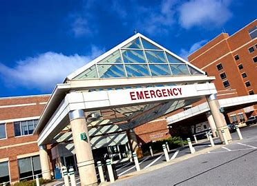
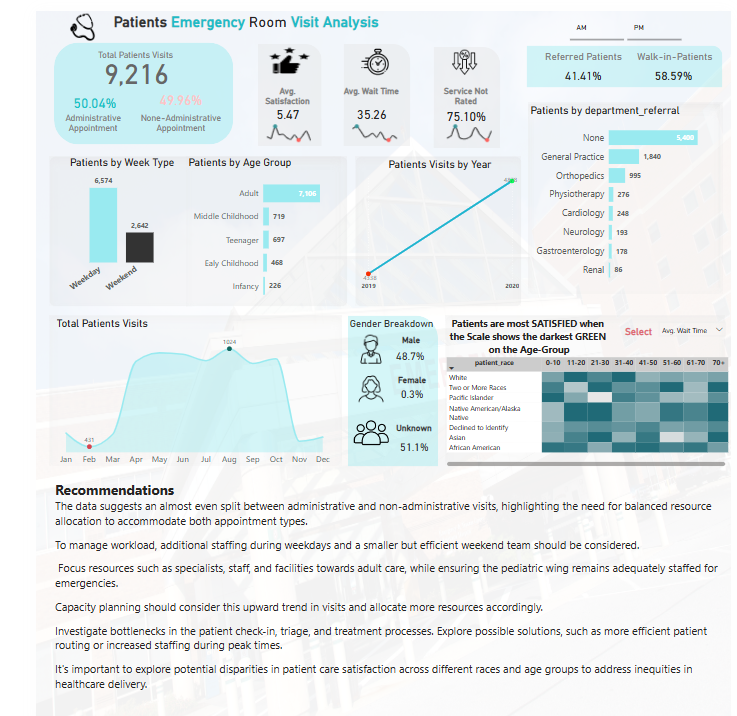

# Analysis of Patient Visits and Service Efficiency in the Emergency Room

This Project provides a detailed overview of 9,216 patient visits, highlighting crucial patterns in patient demographics, service types, and overall hospital performance. By analyzing these patterns, I have identified several areas where improvements can be made to enhance patient satisfaction and streamline emergency room operations.

## About the dataset

| Column Name         | Description                                            |
|---------------------|--------------------------------------------------------|
| date                | Date and time of the patient record                     |
| patient_id          | Unique identifier for each patient                      |
| patient_gender      | Gender of the patient (M for Male, F for Female)        |
| patient_age         | Age of the patient                                      |
| patient_sat_score   | Patient satisfaction score (null indicates missing data)|
| patient_first_initial | First initial of the patient's first name               |
| patient_last_name   | Last name of the patient                                |
| patient_race        | Race of the patient                                     |
| patient_admin_flag  | Boolean indicating if the patient is an admin (TRUE/FALSE)|
| patient_waittime    | Wait time in minutes before being seen                  |
| department_referral | Department to which the patient is referred             |

This data dictionary summarizes each column's meaning and provides context for understanding the dataset.

Link to the Interative Dashboard [Here](https://app.powerbi.com/view?r=eyJrIjoiNzZiNjIwODEtZmM5NS00MGRmLWExNmItMDIxMTgyYmQwYjM2IiwidCI6ImRmODY3OWNkLWE4MGUtNDVkOC05OWFjLWM4M2VkN2ZmOTVhMCJ9)

**Administrative vs. Non-Administrative Appointments**

50.04% of the visits were administrative, while 49.96% were non-administrative. This balance shows that the hospital is catering almost equally to both types of appointments, which means resources need to be balanced accordingly.

**Weekday vs. Weekend Visits**

Unsurprisingly, most visits (6,574) occurred during the week, with fewer (2,642) on the weekends. This indicates a typical weekday rush that needs careful staffing and resource management to avoid burnout while keeping patient care efficient.

**Age Groups**

Adults dominate the visits (7,106), but there’s also a significant number of children coming in, especially in the middle childhood category. This suggests that while adult care should be the focus, pediatric emergency care must remain a priority as well.

**Satisfaction and Wait Times**

The average satisfaction score is 5.47—not bad, but not great either. I noticed that the long 35.26-minute wait time could be a factor. Reducing this will likely increase overall patient satisfaction.

**Patients Visits by Year**

A steady increase from 2019 to 2020 points towards growing demand. We should prepare for future surges, especially as healthcare needs keep evolving post-pandemic.

**Department Referrals**

Interestingly, most patients were not referred to any specific department (5,400). General Practice handled the bulk of referrals (1,840), but there’s a noticeable drop-off in specialized areas like Orthopedics and Cardiology. There may be opportunities here to distribute patient loads more evenly across departments.

**Demographics**

Gender distribution is quite balanced, but there's an opportunity to explore why the satisfaction scores fluctuate more for certain age groups and races. This can help pinpoint areas of improvement in personalized care.

## Recommendations

**1. Shorten wait times:** Prioritizing this will directly boost patient satisfaction and overall hospital performance.

**2. Weekday staff management:** Given the weekday influx, we need to ensure optimal staffing during peak times and reassess weekend staffing strategies.

**3. Plan for growth:** The rising number of visits means it's essential to expand capacity and be prepared for future spikes in patient demand.

**4. Optimize department referrals:** There’s room to improve referral processes and ensure patients are evenly distributed among departments to avoid overburdening General 
Practice.

By addressing these points, the hospital can improve patient experiences, enhance operational efficiency, and prepare for future demands.
